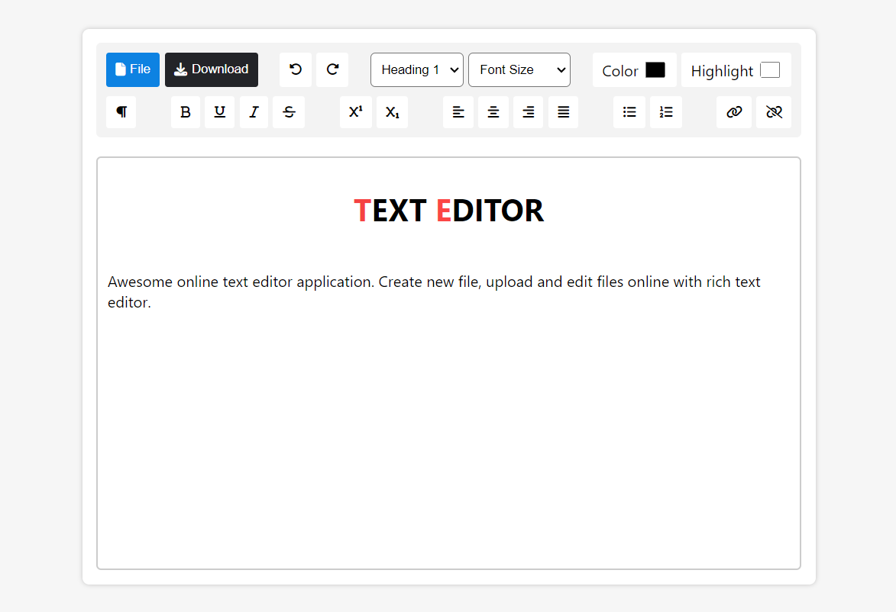

# JavaScript Text Editor

This is a text editor built with static html, css and javaScript.

#### Demo

You can see the live demo by clicking this url

[Text Editor](https://ipritamjaiswal.github.io/text-editor)

#### Features

1. Create new file
2. Open local file
3. Download file as pdf, html or text
4. Edit text with rich text editing options

#### Technologies used

`HTML`, `CSS`, `JavaScript`
Thank You!

